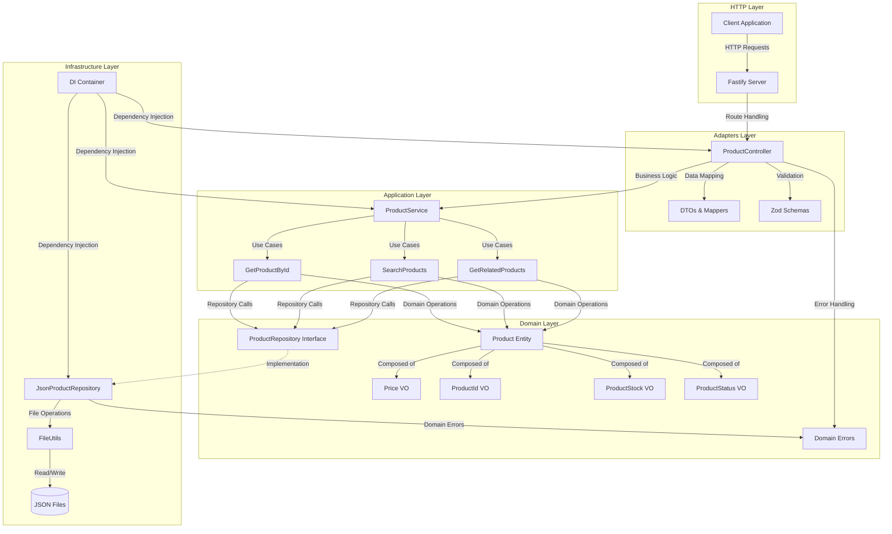

# MercadoLibre Product API - Jessika Carvajal

API de backend que proporciona todos los datos necesarios para admitir una página de detalles del artículo, inspirada en MercadoLibre. Desarrollada como solución para challenge técnico con enfoque en buenas prácticas de desarrollo backend.

## 🎯 Descripción del Challenge

Esta API está diseñada para admitir un frontend proporcionando detalles necesarios del producto, siguiendo las mejores prácticas de desarrollo backend. El endpoint principal obtiene detalles completos del producto junto con información relacionada, todo optimizado para una experiencia similar a MercadoLibre.

## 🏗️ Arquitectura del Sistema

### Diagrama de Arquitectura



### Arquitectura Hexagonal (Ports & Adapters)

- **Domain Layer**: Lógica de negocio pura, entidades y value objects
- **Application Layer**: Casos de uso y servicios de aplicación
- **Infrastructure Layer**: Implementaciones técnicas (persistencia, logging)
- **Adapters Layer**: Interfaces con el mundo exterior (HTTP, DTOs)

## 📡 Endpoints Principales

Base URL: `http://localhost:3000/api/v1`

### 1. Obtener Detalle de Producto (Endpoint Principal)

```http
GET /api/v1/products/{id}
```

**Descripción**: Endpoint principal que obtiene todos los detalles necesarios de un producto para mostrar la página de detalles.

**Parámetros**:
- `id` (string, requerido): ID único del producto

**Respuesta exitosa (200)**:
```json
{
  "data": {
    "id": "MLU475845508",
    "title": "Google Pixel 8 Pro 128GB Dorado",
    "description": "Diseño moderno y funcionalidad excepcional. Compatible con los últimos estándares.",
    "price": {
      "amount": 417.04,
      "currency": "USD"
    },
    "stock": {
      "quantity": 42,
      "isAvailable": true
    },
    "status": "inactive",
    "categoryId": "CAT_ELECTRONICS_PHONES",
    "createdAt": "2023-10-29T21:46:00.103Z",
    "updatedAt": "2024-05-23T07:59:00.810Z",
    "isAvailable": false
  },
  "statusCode": 200
}
```

### 2. Buscar Productos

```http
GET /api/v1/products?categoryId={categoryId}&limit={limit}&offset={offset}
```

**Descripción**: Busca productos con filtros opcionales y paginación.

**Query Parameters**:
- `categoryId` (string, opcional): Filtrar por categoría
- `limit` (number, opcional): Número de productos por página (default: 10)
- `offset` (number, opcional): Número de productos a saltar (default: 0)

### 3. Productos Relacionados

```http
GET /api/v1/products/{id}/related?limit={limit}
```

**Descripción**: Obtiene productos relacionados basados en categoría y características similares.

**Parámetros**:
- `id` (string, requerido): ID del producto base
- `limit` (number, opcional): Número de productos relacionados (1-20, default: 4)

### 4. Health Check

```http
GET /health
```

**Descripción**: Endpoint para verificar el estado del servidor.

## 🛠️ Stack Tecnológico

### Backend Framework
- **Fastify**: Framework web rápido y eficiente para Node.js
  - Validación automática con JSON Schema
  - Serialización optimizada
  - Plugin ecosystem robusto
  - Logging integrado con Pino

### Lenguaje y Tipado
- **TypeScript**: Desarrollo con tipos estáticos
  - Mejor experiencia de desarrollo
  - Detección temprana de errores
  - IntelliSense avanzado
  - Refactoring seguro

### Persistencia
- **Archivos JSON**: Persistencia local sin base de datos
  - `data/products.json`: Base de datos principal de productos
  - `data/categories.json`: Catálogo de categorías
  - **FileUtils**: Utilidades para operaciones de archivo seguras

### Testing
- **Vitest**: Framework de testing moderno
  - Tests unitarios comprehensivos
  - Cobertura de código
  - Mocking avanzado
  - Integración con TypeScript

### Validación y Schemas
- **Zod**: Validación de esquemas TypeScript-first
  - Validación de request/response
  - Type inference automático
  - Error messages descriptivos

### Calidad de Código
- **ESLint**: Linting con reglas personalizadas
- **Prettier**: Formateo automático de código
- **TypeScript Compiler**: Verificación de tipos estática

## 🏃‍♂️ Inicio Rápido

### Prerrequisitos
- Node.js >= 18.0.0
- npm

### Instalación
```bash
# Clonar repositorio
git clone <repository-url>
cd meli-test

# Instalar dependencias
npm install

# Generar datos de prueba
npm run seed

# Iniciar en modo desarrollo
npm run dev
```

La API estará disponible en: `http://localhost:3000`

### Verificación
```bash
# Health check
curl http://localhost:3000/health

# Obtener producto
curl http://localhost:3000/api/v1/products/MLU475845508
```

## 📋 Scripts Disponibles

- `npm run dev` - Servidor en modo desarrollo con recarga automática
- `npm run build` - Compilar TypeScript a JavaScript
- `npm start` - Servidor en modo producción
- `npm run seed` - Generar datos de prueba
- `npm run seed:clean` - Limpiar datos de prueba
- `npm test` - Ejecutar suite de pruebas
- `npm run test:coverage` - Pruebas con reporte de cobertura
- `npm run test:watch` - Pruebas en modo watch
- `npm run lint` - Ejecutar linter
- `npm run format:fix` - Formatear código
- `npm run typecheck` - Verificar tipos TypeScript

## 🔧 Decisiones Arquitectónicas Clave

### 1. Arquitectura Hexagonal
**Decisión**: Implementar arquitectura hexagonal con separación clara de capas.

**Razón**: 
- Testabilidad: Permite testing aislado de cada capa
- Mantenibilidad: Cambios en infraestructura no afectan dominio
- Escalabilidad: Fácil intercambio de implementaciones
- Claridad: Separación explícita de responsabilidades

### 2. Persistencia en JSON
**Decisión**: Usar archivos JSON en lugar de base de datos.

**Razón**:
- Requerimiento específico del challenge
- Simplicidad de setup y deployment
- Ideal para prototipado y demos
- Fácil inspección y debugging

### 3. Validación con Zod
**Decisión**: Usar Zod para validación en lugar de JSON Schema puro.

**Razón**:
- Type-safety automático con TypeScript
- Mejor experiencia de desarrollo
- Mensajes de error más descriptivos
- Integración perfecta con el ecosystem TypeScript

### 4. Fastify sobre Express
**Decisión**: Elegir Fastify como framework web.

**Razón**:
- Performance superior
- Validación automática built-in
- Plugin architecture
- Logging integrado optimizado
- TypeScript support nativo

### 5. Value Objects en Domain
**Decisión**: Implementar Price, ProductId, Stock como Value Objects.

**Razón**:
- Encapsulación de lógica de validación
- Inmutabilidad garantizada
- Expresividad del modelo de dominio
- Prevención de primitive obsession

## 🚀 Características Destacadas

### Manejo de Errores Robusto
- **Errores de Dominio**: `ProductNotFoundError`, `InvalidSearchParamsError`
- **Error Handler Global**: Captura y formatea errores consistentemente
- **Status Codes Apropiados**: HTTP status codes semánticamente correctos
- **Logging Estructurado**: Logs detallados para debugging

### Performance Optimizada
- **Búsquedas Eficientes**: Algoritmos optimizados para archivos JSON
- **Caching Estratégico**: Cache en memoria para datos frecuentemente accedidos
- **Paginación**: Evita cargar datasets completos
- **Lazy Loading**: Carga datos solo cuando es necesario

### Testing Comprehensivo
- **Cobertura > 90%**: Tests unitarios extensivos
- **Test Doubles**: Mocks y stubs para aislamiento
- **Edge Cases**: Cobertura de casos límite y errores
- **Integration Tests**: Tests de flujo completo

### Developer Experience
- **TypeScript Everywhere**: Type safety en todo el codebase
- **Hot Reload**: Desarrollo con recarga automática
- **Logging Detallado**: Información completa para debugging
- **Scripts Convenientes**: Comandos para todas las tareas comunes

## 📚 Documentación Adicional

- **[run.md](./run.md)**: Instrucciones detalladas de ejecución
- **[prompts.md](./prompts.md)**: Documentación del uso de herramientas AI
- **[postman_collection.json](./postman_collection.json)**: Colección de Postman con todos los endpoints
- **[postman_environment.json](./postman_environment.json)**: Variables de entorno para Postman

## 🔧 Testing con Postman

### Endpoints Incluidos

- ✅ **Health Check** - Verificar estado del servidor
- ✅ **Obtener Producto** - Detalle completo con tests automatizados
- ✅ **Buscar Productos** - Con paginación y filtros
- ✅ **Buscar por Categoría** - Filtros específicos
- ✅ **Productos Relacionados** - Algoritmo de recomendación
- ✅ **Casos de Error** - Manejo de errores 400/404/500

### Tests Automatizados

Cada endpoint incluye tests automatizados que verifican:
- Status codes correctos
- Estructura de respuesta
- Validación de datos
- Casos de error
- Límites y validaciones

## 🧪 Testing

### Ejecutar Tests
```bash
# Todos los tests
npm test

# Con cobertura
npm run test:coverage

# Modo watch
npm run test:watch

# UI interactiva
npm run test:ui
```